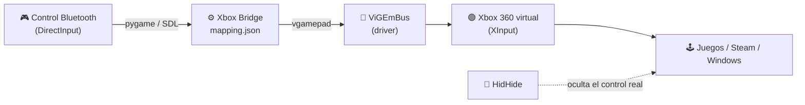

<div align="center">


```
 __  __ _                    ____       _     _
 \ \/ /| |__   _____  __    | __ ) _ __(_) __| | __ _  ___
  \  / | '_ \ / _ \ \/ /    |  _ \| '__| |/ _` |/ _` |/ _ \
  /  \ | |_) | (_) >  <     | |_) | |  | | (_| | (_| |  __/
 /_/\_\|_.__/ \___/_/\_\    |____/|_|  |_|\__,_|\__, |\___|
                                                |___/
   >> DirectInput (Bluetooth) ---------> Xbox 360 (XInput) <<
```

**Convierte cualquier control Bluetooth / DirectInput en un mando Xbox 360 virtual que Windows y tus juegos reconocen de forma nativa.**

[](https://github.com/sti-diaz/xboxbridge/releases/latest)
[](https://www.python.org/)
[](https://github.com/nefarius/ViGEmBus/releases)
[](https://github.com/sti-diaz/xboxbridge/releases/latest)

<a href="https://www.paypal.com/donate/?hosted_button_id=GJP62Y73ZDBR8">
  
</a>

</div>

---

## `> whoami`

Muchos controles genéricos (y algunos de marca) se conectan por Bluetooth como **DirectInput**. El problema: la mayoría de los juegos modernos solo hablan **XInput** (el protocolo del mando de Xbox). Resultado → botones cruzados, sticks invertidos o el control simplemente ignorado.

**Xbox Bridge** se para en el medio:



Lee el control real ~250 veces por segundo y replica cada botón, stick y gatillo en un mando Xbox 360 virtual.

---

## `> features --list`

| | Feature | Detalle |
|:-:|---|---|
| 🧭 | **Asistente de mapeo** | Te pide presionar cada botón, mover cada stick y apretar cada gatillo. Detecta solo si el gatillo es analógico o digital. Se hace **una sola vez**. |
| 🎮 | **Emulación Xbox 360** | Botones, D-pad, sticks con zona muerta y gatillos → mando XInput virtual vía ViGEmBus. |
| 🟢 | **Bandeja del sistema** | Vive junto al reloj. Ícono con LED de estado: 🟢 emulando · 🔵 mapeando · ⚪ detenido. |
| 🚀 | **Inicio con Windows** | Arranca oculto en la bandeja y empieza a emular solo. Si el control aún no está emparejado, lo espera. |
| ❌ | **Cerrar a tu manera** | Al cerrar: *Segundo plano* / *Cerrar completamente* / *Preguntar*, con "recordar mi elección". |
| 🔒 | **Instancia única** | Abrirlo dos veces no crea dos mandos virtuales: la segunda instancia trae al frente la primera. |
| 📦 | **Portable o instalable** | Un `.exe` suelto o un instalador que no pide permisos de administrador. |

---

## `> install`

### 0. Requisitos (una sola vez)

```diff
+ [OBLIGATORIO]  ViGEmBus  → el driver que crea el mando Xbox virtual
+                https://github.com/nefarius/ViGEmBus/releases
! [RECOMENDADO]  HidHide   → oculta el control real para que los juegos no vean DOS mandos
!                https://github.com/nefarius/HidHide/releases
```

### 1. Descarga

Ve a **[Releases](https://github.com/sti-diaz/xboxbridge/releases/latest)** y elige tu sabor:

| Archivo | Tipo | Para quién |
|---|---|---|
| `XboxBridge_Setup.exe` | 📦 Instalador | Lo normal. Accesos directos, inicio con Windows, desinstalador. |
| `XboxBridge.exe` | 🧳 Portable | Un solo archivo, sin instalar nada. Ideal para un pendrive. |

### 2. Instala

```console
C:\> XboxBridge_Setup.exe
  [✓] Se instala en %LOCALAPPDATA%\Programs\Xbox Bridge   (sin admin)
  [✓] Opción: "Iniciar con Windows y emular automáticamente"
  [✓] Opción: acceso directo en el escritorio
```

### 3. Configura HidHide *(si lo usas)*

1. Abre **HidHide Configuration Client**.
2. Pestaña **Applications** → agrega `XboxBridge.exe`
   - Instalado: `%LOCALAPPDATA%\Programs\Xbox Bridge\XboxBridge.exe`
   - Portable: donde lo hayas dejado.
3. Pestaña **Devices** → marca tu control Bluetooth → activa **Enable device hiding**.

> [!IMPORTANT]
> Si no agregas `XboxBridge.exe` en *Applications*, la app tampoco verá el control oculto y se quedará en "Esperando control...".

---

## `> usage`

```console
┌─ Xbox Bridge ─────────────────────────────────────────┐
│  ● Control sin mapear. Presiona "Mapear".             │
│                                                       │
│        [ MAPEAR ]            [ EMULAR ]               │
└───────────────────────────────────────────────────────┘
```

1. **Empareja** el control por Bluetooth en Windows.
2. Abre **Xbox Bridge** → **`MAPEAR`** → sigue las instrucciones en pantalla:
   ```text
   == Botones ==        Presiona: A, B, X, Y, LB, RB, BACK, START, GUIDE, L3, R3
   == Sticks ==         Empuja cada stick hasta el tope y suelta
   == Gatillos ==       Aprieta LT / RT a fondo, mantén medio segundo y suelta
   ```
3. **`EMULAR`** → el LED se pone 🟢 y Windows ya ve un *Xbox 360 Controller*.
4. Cierra la ventana → elige **Segundo plano** para que siga funcionando desde la bandeja.

> [!TIP]
> Comprueba que funciona con `Win + R` → `joy.cpl`: debería aparecer **Controller (XBOX 360 For Windows)**.

### Dónde se guardan las cosas

```text
%APPDATA%\XboxBridge\
├── mapping.json     ← tu mapeo (botón/eje físico → botón Xbox)
└── settings.json    ← preferencias (qué hacer al cerrar, etc.)
```

La versión portable usa un `mapping.json` que esté **junto al .exe** si existe; si no, usa la carpeta de arriba.

---

## `> troubleshoot`

| Síntoma | Causa probable | Fix |
|---|---|---|
| Error con **ViGEm** al emular | Falta el driver | Instala [ViGEmBus](https://github.com/nefarius/ViGEmBus/releases) y reinicia. |
| Se queda en *"Esperando control..."* | Control no emparejado, o HidHide lo oculta también de la app | Empareja el control / agrega `XboxBridge.exe` en HidHide → *Applications*. |
| El juego recibe **doble input** | El juego ve el control real **y** el virtual | Activa HidHide sobre el control real. |
| Botones cruzados o sticks invertidos | Mapeo viejo o de otro control | **`RE-MAPEAR`**. |
| Los gatillos no responden | Algunos controles los reportan raro | Re-mapea apretando el gatillo **a fondo** y manteniéndolo medio segundo. |

---

## `> build --from-source`

```powershell
# 1. Dependencias
git clone https://github.com/sti-diaz/xboxbridge.git
cd xboxbridge
python -m pip install -r requirements.txt

# 2. Ejecutar directo (desarrollo)
python xbox_bridge_gui.py          # interfaz gráfica
python xbox_bridge.py --map        # mapeo por consola
python xbox_bridge.py --probe      # ver ejes/botones crudos en vivo
python xbox_bridge.py              # puente por consola

# 3. Compilar portable + instalador → .\final\
winget install JRSoftware.InnoSetup
powershell -ExecutionPolicy Bypass -File .\build_installer.ps1
```

```text
xboxbridge/
├── xbox_bridge.py        → núcleo: lectura del control, asistente de mapeo, puente a ViGEm
├── xbox_bridge_gui.py    → interfaz Tk, bandeja, inicio con Windows, instancia única
├── build_installer.ps1   → PyInstaller (portable + carpeta) + Inno Setup
├── installer.iss         → definición del instalador
├── requirements.txt
└── logo.png
```

**Stack:** `pygame` (SDL / DirectInput) · `vgamepad` (ViGEmBus) · `tkinter` · `pystray` · `Pillow` · `PyInstaller` · `Inno Setup`

---

<div align="center">

## `> sudo support --this-project`

Si Xbox Bridge revivió tu control y te ahorró comprar uno nuevo,<br>
invítame un café ☕ y ayuda a que el proyecto siga vivo.

<a href="https://www.paypal.com/donate/?hosted_button_id=GJP62Y73ZDBR8">
  
</a>

<br><br>

```text
[■■■■■■■■■■■■■■■■■■■■] 100%  gracias por jugar 🎮
```

<sub>Hecho con 💚 por <a href="https://github.com/sti-diaz">@sti-diaz</a> · Xbox es una marca de Microsoft; este proyecto no está afiliado a Microsoft.</sub>

</div>
